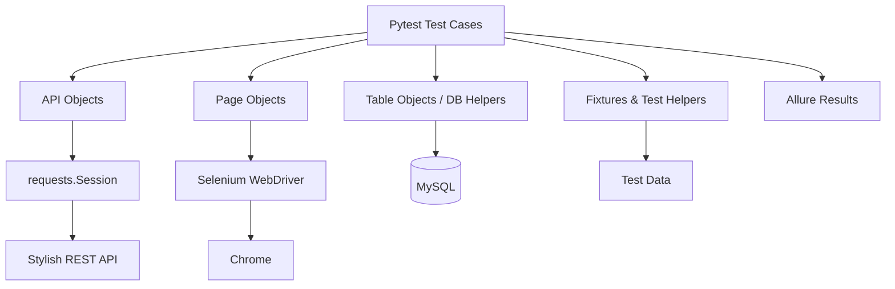

# Stylish Automation Test Framework 🧪

> 一個整合 **Web UI、REST API、MySQL 資料驗證、平行執行與 Allure Report** 的 Pytest 自動化測試專案。


## 專案背景

這個專案最初完成於 **AppWorks School Automation Test Program Batch 2**，測試目標是課程使用的 Stylish 電商系統。

Stylish 與專案題目來自課程；這個 repository 保留的是我自己的 automation framework、test cases 與實作方式。不同學員會依自己的設計拆分 fixture、Page Object、API Object、DB 驗證與測試流程，因此我將自己的版本整理成獨立 repository 保存。

多年後重新整理這個專案時，我保留原本的測試意圖與 Web / API / DB cross-validation，同時重新整理 framework boundary、test isolation、credential handling 與重複測試邏輯，讓它更接近現在會採用的 automation project structure。

> [!NOTE]
> 這是一個歷史課程專案與作品紀錄，不代表目前 Stylish 測試環境仍可公開存取。完整 integration run 仍需要對應的 Web、API、MySQL、測試帳號與 TapPay sandbox 設定。

## 這個專案測什麼？

### 🌐 Web UI

使用 Selenium + Page Object Model 驗證使用者從瀏覽商品到結帳，以及管理端建立商品等流程。

- Login
- 商品分類 / 搜尋 / 商品頁
- 購物車
- Checkout
- Admin 建立 / 刪除商品
- Browser screenshot → Allure attachment

### 🔌 REST API

使用 `requests.Session` 與 API Object 封裝 endpoint，涵蓋：

- Login / Logout / Profile
- 商品分類、搜尋、詳細資料
- Admin 建立 / 刪除商品
- 建立訂單 / 查詢訂單
- TapPay sandbox prime flow

### 🗄️ Database Validation

透過 PyMySQL 直接查詢 Stylish MySQL database，將 API 或 UI 取得的結果與 DB 資料交叉比對，例如：

- 商品基本資料
- Color / Variant
- Product images
- User data
- API response ↔ DB consistency

## 架構



### 主要目錄

```text
.
├── api_objects/          # REST API request objects
├── page_objects/         # Selenium Page Objects
├── table_object/         # domain-oriented DB query helpers
├── db_utilis/            # database infrastructure helpers
├── tests_api/            # API + DB integration tests
├── tests_web/            # Web UI tests
├── test_data/            # data-driven test data / upload fixtures
├── utils/                # ApiBase, PageBase, WebDriver factory...
├── conftest.py           # root fixtures / DB lifecycle
├── pytest.ini            # pytest + Allure defaults
└── exec_test.sh          # historical local / CI runner
```

## 設計重點

### API Object

每個 endpoint 封裝成小型 request object；共用的 base URL、query params、headers 與 request lifecycle 由 `ApiBase` 處理。

```python
class ProductsSearchApi(ApiBase):
    def __init__(self, session, keyword, paging):
        super().__init__(session, "/products/search")
        self.params = {"keyword": keyword, "paging": paging}

    def send(self):
        return self.api_request("get", params=self.params)
```

這讓 test case 不需要自己組 URL，也避免 endpoint object 任意修改 shared session state。

### Page Object

Page Object 專注在「頁面上能做什麼、能讀到什麼」，DB lookup 與 assertion 留在 test/helper layer。

```python
class LoginPage(PageBase):
    input_email = (By.ID, "email")
    input_password = (By.ID, "password")

    def login(self, email, password):
        self.find_element(self.input_email).send_keys(email)
        self.find_element(self.input_password).send_keys(password)
```

### Test Isolation

- function-scoped browser lifecycle
- API test 使用獨立 `requests.Session`
- parametrized test data 不在 Page Object 中原地修改
- cleanup 使用明確 fixture / `try...finally`
- 支援一般 pytest 與 pytest-xdist worker credential assignment

### Secret / Credential Handling

真實 credential 不應 commit 到 repository。

- Stylish account / password → environment variables
- DB credential → environment variables
- TapPay sandbox config → environment variables
- request logs 不輸出 Authorization、cookies、password 或 JWT

## 快速開始

### 1. 建立環境

```bash
git clone https://github.com/Andy-CH-BO-AN/Automation-Test-Project-Stylish.git
cd Automation-Test-Project-Stylish

python3 -m venv .venv
source .venv/bin/activate
pip install -r requirements.txt
```

Windows：

```powershell
.venv\Scripts\activate
```

### 2. 設定環境變數

以 `.env-template` 為範本：

```bash
cp .env-template .env
```

主要設定包含：

```env
DOMAIN=https://your-web-domain
BASE_URL=https://your-api-base-url

DB_HOST=your-db-host
DB_PORT=3306
DB_USERNAME=your-db-user
DB_PASSWORD=your-db-password
DB_NAME=your-db-name

USER_NAME_1=your-first-test-user
USER_NAME_2=your-second-test-user
PASSWORD=your-test-password

X_API_KEY=your-tappay-api-key
TAPPAY_CARD_NUMBER=your-sandbox-card-number
TAPPAY_CARD_DUE_DATE=your-sandbox-card-expiry
TAPPAY_CARD_CCV=your-sandbox-card-ccv
```

也可以用 `ENV` 指定其他 env file：

```bash
ENV=.env.staging pytest
```

## 執行測試

### API tests

```bash
pytest tests_api/ -v
```

### Web tests

```bash
pytest tests_web/ -v
```

### 平行執行 + retry

```bash
pytest -n 2 --reruns 1
```

使用兩個 xdist worker 時：

```text
gw0 → USER_NAME_1
gw1 → USER_NAME_2
```

一般非 xdist 執行則使用第一組測試帳號。

## Allure Report

`pytest.ini` 預設將結果輸出到 `./allure-results`：

```bash
pytest
allure generate ./allure-results/ -o ./allure-report/ --clean
```

舊專案也保留了完整 runner：

```bash
./exec_test.sh
```

它會建立 virtualenv、安裝 dependency、使用 2 workers + 1 retry 執行 pytest，再產生 Allure report。

## 技術棧

| 類型 | 技術 |
| --- | --- |
| Test runner | Pytest |
| Web automation | Selenium 4 |
| API | Requests |
| Database | MySQL / PyMySQL |
| Data-driven testing | pandas / openpyxl |
| Parallel execution | pytest-xdist |
| Retry | pytest-rerunfailures |
| Reporting | Allure |
| Driver management | webdriver-manager |
| Configuration | python-dotenv |

## 從當年的版本到現在

這個 repository 也保留了一個很有趣的演進紀錄。

| 當年的寫法 | 整理後 |
| --- | --- |
| endpoint object 自己拼完整 URL | `ApiBase` 統一處理 base URL |
| object constructor 可能修改 shared session headers | request-specific headers 不污染 session |
| upload file 在 constructor 就 `open()` | file handle 僅存在 request lifecycle |
| Page Object 直接查 DB | UI 與 DB verification 分層 |
| test data dict 被 method 原地修改 | 使用 copy / normalized result |
| 重複 setup / teardown | test helper + fixture / `try...finally` |
| JWT / request context 可能進 log | sensitive values 不寫入 log |
| Selenium setup 寫在 `conftest.py` | WebDriver factory 與 pytest lifecycle 分離 |

這次整理的目標不是把以前的專案全部推倒重寫，而是保留當時的測試思路，再用現在比較熟悉的方式把責任邊界整理清楚。

## CI / 歷史環境

原始課程版本曾使用 Jenkins 執行 automation pipeline。Public repository 不保留當年的 Jenkins host、登入資訊或其他 environment-specific credentials。

目前保留 `exec_test.sh` 作為當時 CI flow 的可閱讀版本：

```text
venv
  ↓
install dependencies
  ↓
pytest -n 2 --reruns 1
  ↓
allure results
  ↓
allure report
```

## 備註

這個 repository 的價值主要不是「今天還能不能對當年的 Stylish environment 按一下就全綠」，而是記錄一套完整 automation project 如何同時處理：

**Web UI → API → Database → Parallel execution → Reporting**。

也是我早期把測試從單純 Selenium script，往 framework、data-driven testing 與 cross-layer validation 發展的一個作品紀錄。
